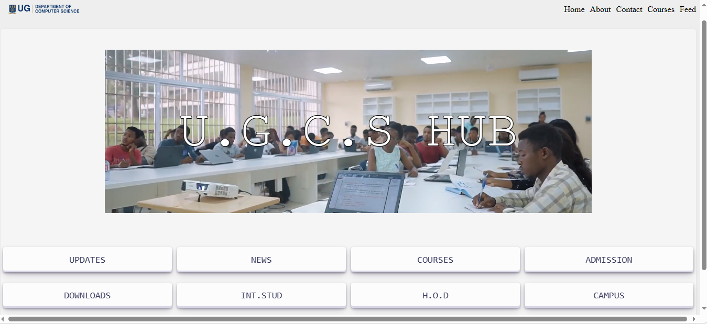
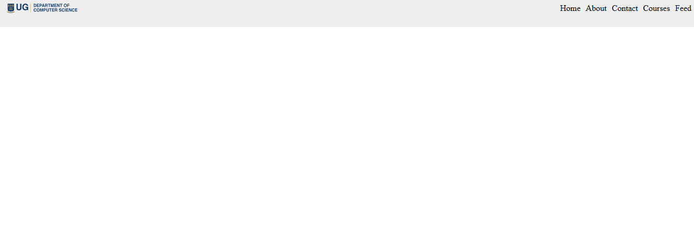

# DCIT 205 IA

## Introduction
An Alternative Version of the UGCSD Website. Simple UI and more straight forward. I removed a lot of excessive element. Here is another version but created with bootstrap at this link. 
## Setup

Follow these steps to clone repository:

* Fork this repository to your own GitHub account.
* Copy the URL of your forked repository.
* (Open your terminal and navigate to the directory where you want to clone the project.
* Run the command "git clone "<URL>"" where "<URL>" is the URL of your forked repository.
* Open the project folder in your code editor of choice.
* To view the website, open the index.html file in your browser or use a Live server extension.

## Author

Nathan Attoh - 11357227

## Screenshots
Below are some Screenshots of the website
* HomePage

* Header

* Footer

* Downloads Page

* H.O.D

* NewsFeed

* International Studies

* Campus

* Admission

## What I Learnt
- Some Useful functions for Javascript
- Understood the layout of HTML pages better
- Better directory management for web files

